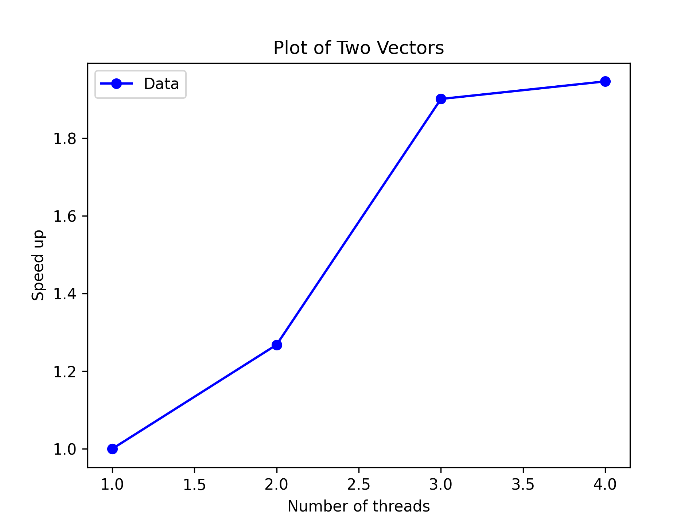

# Examen machine OS 202 du 18 Mars 2025

- Tous les documents sont autorisés.
- **A rendre** : Les trois fichiers pythons parallélisés et un document (pdf, markdown, etc.) pour les réponses aux questions.
- Les fichiers devront être envoyés sous forme de fichiers pythons *non compressés* aux adresses suivantes (selon votre groupe de TP) :
  - xavier.juvigny@onera.fr (Groupe 1)
  - jean-didier.garaud@onera.fr (Groupe 2)
  - apf@crans.org (Groupe 3)

Bon courage !

## A] Traitement de l'image et convolution

Les trois scripts python à paralléliser se reposent sur le même type d'algorithme.

Dans les trois scripts, on cherche à doubler la taille des images (issues de vidéo dans le premier cas, d'une photo dans les deux autres cas) en évitant d'obtenir une version trop pixellisée de l'image finale.

Pour cela, après avoir chargé l'image en RGB (Rouge-Vert-Bleu), on effectue une transformation de l'espace de couleur pour passer dans l'espace de couleur HSV ( Hue (Teinte) - Saturation - Value ) où les composantes H et S permettent de définir une couleur et V l'intensité
lumineuse du pixel (équivalent à un niveau de gris).

L'idée va être de lisser l'image à l'aide d'un flou gaussien sur les trois composantes (H, S et V) de l'image, puis effectuer un filtre de
netteté uniquement sur la composante V. L'idée est que l'œil humain voit avec précision les niveaux de gris mais très grossièrement les couleurs (le cerveau faisant ensuite un traitement pour composer *in fine* une image en couleur précise !)

Pour ces deux filtres, on va utiliser des convolutions discrètes en 2D. Une convolution discrète en 2D est une généralisation de la convolution
en 1D et consiste à avoir pour fonction de convolution une matrice $F$ de dimension $(2m+1)\times (2n+1)$ dont les indices pour les lignes et les colonnes commencent à $-m$ et finissent en $+m$ pour les lignes et $-n$ à $n$ pour les colonnes. Le champ à convoler sera une grille 2D $G$ ayant pour valeurs $g_{ij}$ pour la ième ligne et jème colonne. Les conditions limites seront prises comme une "répétition des valeurs au bord du domaine" (correspond à l'argument `mode='same'` de la fonction `signal.convolve2d`).

La grille $C = F\star G$ convolée sera obtenue pour la valeur $c_{ij}$ se trouvant à la ième ligne et jème colonne par :

$$
C_{i,j} = \sum_{k=-m}^{+m}\sum_{l=-n}^{+n}F_{k,l}.G_{i+k,j+l}
$$

Pour le filtre Gaussien, on choisit pour matrice de convolution la matrice :

$$
F_{G} = \frac{1}{16}\left(\begin{array}{ccc}
1 & 2 & 1 \\
2 & 4 & 2 \\
1 & 2 & 1
\end{array}\right)
$$

Pour le filtre de netteté, on choisit la matrice de convolution suivante :

$$
F_{S} = \left(\begin{array}{ccc}
 0 & -1 &  0 \\
-1 & 5  & -1 \\
 0 & -1 &  0 \end{array}\right)
$$

Dans le troisième exercice, on appliquera toujours le filtre gaussien pour les composantes H et S de l'image, mais on n'appliquera qu'un seul filtre à la composante V, permettant à la fois de faire un lissage et un filtre de netteté. Ce filtre de dimension $5\times 5$ est le suivant :

$$
F_{D} = \frac{1}{256}\left(\begin{array}{ccccc}
1 &  4 & 6 &  4 &  1 \\
4 & 16 & 24& 16 &  4 \\
6 & 24 & -476 & 24 & 6 \\
4 & 16 & 2    & 16 & 4 \\
1 &  4 & 6 & 4 & 1
\end{array}\right)
$$

## B À FAIRE

Les codes seront parallélisés en utilisant MPI.

### 1. Environnement de calcul

Donner le nombre de cœurs logiques contenus sur votre machine ainsi que la taille des mémoires caches L1, L2 et L3.

CPU family:          6
  Model:               142
  Thread(s) per core:  2
  Core(s) per socket:  2
  Socket(s):           1
L1d:                   64 KiB (2 instances)
L1i:                   64 KiB (2 instances)
L2:                    512 KiB (2 instances)
L3:                    4 MiB (1 instance)

### 2. Parallélisation d'images issues d'une vidéo

Le but de ce programme est de doubler la taille des images d'une vidéo sans trop pixelliser les images agrandies.

On va donc appliquer les filtres $F_{G}$ et $F_{S}$ vus plus haut sur un grand nombre d'images (les images issues de la vidéo). 

- Expliquer votre stratégie de parallélisation et pourquoi ce type de parallélisation est bien adapté à ce problème et est optimal.

Réponse : Le traitement des images issues d'une vidéo est un problème embarrassingly parallel, car chaque image peut être traitée indépendamment des autres. Cela signifie que l'on peut distribuer les images sur les différents processus MPI sans nécessiter de communication entre eux, sauf pour la collecte des résultats finaux. Je n'ai pas implémenté le modèle maître-esclave, mais il serait bien plus adapté dans le contexte d'une vidéo en temps réel, où les images doivent être traitées dans l'ordre.

Algo:
Distribution des images : Le processus maître (rank 0) divise la liste des images en sous-ensembles et les distribue aux autres processus.
Traitement des images : Chaque processus applique les filters sur ses images attribuées.
Collecte des résultats : Les processus envoient leurs résultats au processus maître, qui les sauvegarde.

- Paralléliser le programme `movie_filter.py` correspondant à ce problème.

Reponse: Le fichier  `movie_filterMPI.py`

- Calculer en fonction du nombre de processus utilisé (dans la limite du nombre de coeurs dont vous disposez) la courbe d'accélération de votre programme parallèle.

Reponse: 

Le répertoire `sorties/perroquets` contient un fichier `perroquets.md5sum`. Celui-ci peut être utilisé pour vérifier que votre parallélisation n'a pas modifié les images résultats :

	cd sorties/perroquets
	md5sum -c perroquets.md5sum

### 3. Parallélisation d'une photo en haute résolution (1)

Le but de ce programme est de doubler la taille d'une photo tout en évitant d'avoir une photo pixellisée à la fin.

On cherche à ce que chaque processus utilise un minimum de mémoire en évitant de prendre des bouts d'images trop grands par processus (uniquement le strict minimum nécessaire pour la parallélisation).

On applique ici consécutivement les filtres $F_{G}$ sur les trois composantes H, S et V de l'image et $F_{S}$ sur la composante $V$ de l'image.

- Expliquer votre stratégie de parallélisation et pourquoi ce type de parallélisation est adapté à votre problème.

Reponse: Pour une seule image en haute résolution, on ne peut pas simplement distribuer des images indépendantes. Au lieu de cela, on divise l'image en bandes horizontales ou verticales et on attribue chaque bande à un processus. Chaque processus doit recevoir une bande légèrement plus grande que nécessaire pour inclure les pixels nécessaires à la convolution (halo). Ça va reduire la memóre par processus et avoir une granulité plus grande

    Algo:

    Diviser l`image: load l'image avec rank == 0 et divise pour les plusiers processus avec 

    Scatter: La division va être(Domain Decomposition) faire dans l'horizontal. A priori le programme n'est pas capable de resoudre tailles de img qui ne sont pas divisibles par npb, mais il faut juste adjuster avec le calcule du rest et du rank aprés.

    Processing: Chaque processus va travailler sur son sous-image (mask, blur, sharpen...)

    Gathering: Après on va gather tous les resultas dans le rank = 0 avec Gather.

- Est-ce que cette stratégie mise en place serait optimale pour la parallélisation que vous avez effectuée en 2.

Reponse: Cette stratégie n'est pas optimale pour le traitement d'images indépendantes (question 2), car elle introduit des communications inutiles. Mais on peut faire de parallélisation entre plusier images et dans chaque image aussi, mais il va reduire la quantité maximale de images traités au même temps, mais chaque batch de images vont être traités plus rapidement. 

- Paralléliser le programme `double_size.py` correspondant à ce problème.

Reponse: Le fichier  `doublesizeMPI.py`

- Calculer en fonction du nombre de processus utilisé (dans la limite du nombre de coeurs dont vous disposez) la courbe d'accélération de votre programme parallèle.

Reponse: (Pour l'image originale resized a 375,211, je n'avais pas du cache pour l'image originale)

### 4. Parallélisation d'une photo en haute résolution (2)

Le but de ce programme est de doubler la taille d'une photo tout en évitant d'avoir une photo pixellisée à la fin.

On cherche à ce que chaque processus utilise un minimum de mémoire en évitant de prendre des bouts d'images trop grand par processus (uniquement le strict minimum nécessaire pour la parallélisation).

On applique le filtre $F_{G}$ sur les deux composantes $H$ et $S$ de l'image et le filtre $F_{D}$ sur la composante $V$ de l'image.

- Expliquer votre stratégie de parallélisation et pourquoi ce type de parallélisation est adapté à votre problème.

Reponse: La deuxième stratégie consiste à diviser l'image en blocs et à implémenter le modèle maître-esclave. Ainsi, le processus avec rank == 0 enverra des blocs à chaque processeur et, à chaque nouvelle tâche, il enverra le bloc à un processeur libre. De leur côté, les processus avec rank != 0 traiteront leur bloc et l'enverront au processus rank == 0, qui assemblera les résultats.

- Quelles sont les différences, désavantages et avantages de votre stratégie de parallélisation par rapport à la question précédente ?

Reponse:  La principale différence est que la division des tâches est dynamique et non statique comme dans la stratégie précédente. Cela signifie que les tâches sont attribuées aux processeurs au fur et à mesure qu'ils deviennent disponibles, plutôt que de leur être assignées à l'avance.

Avantages: 1.Les processeurs ne restent pas inactifs en attendant que les autres terminent leur travail.
          2.Certains blocs d’image peuvent être plus longs à traiter que d'autres, et cette stratégie réduit le temps total d’exécution.
Desavantages: 1. Il faut gérer l’envoi et la réception des blocs de manière asynchrone.
              2. Le processus maître doit coordonner les tâches, ce qui peut devenir un goulot d’étranglement si le nombre de processus est élevé.

- Paralléliser le programme `double_size2.py` correspondant à ce problème.

Reponse: Dans le fichier double_size2MPI.py
- Calculer en fonction du nombre de processus utilisé (dans la limite du nombre de coeurs dont vous disposez) la courbe d'accélération de votre programme parallèle.

